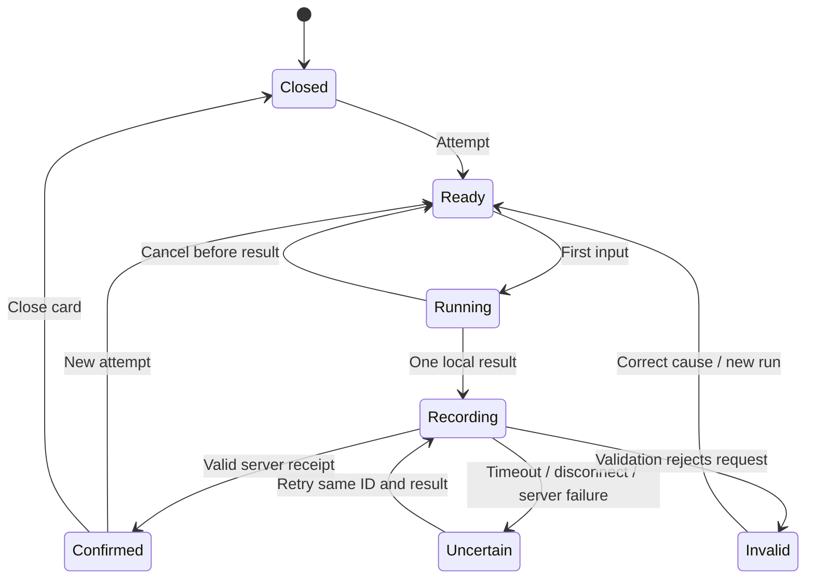

> Current feed: posts, composer and objectives only. The owner removed recent-results, recent-activity and rejection-counter sections. Full pass/fail receipts remain in the gate flow. Survival contracts/engine/detectors are integrated but not connected to a browser runtime; follow MAIN_GAME_PLAN for that later slice.

> Current session routing: `/` redirects already-admitted browsers to `/feed`. `GateClient` owns name/test/result interaction; Enter feed makes a server navigation after the cookie is issued. Feed identity and initial humanity come from server admission; progress loading or failure never means unverified. Admission loss (posts 401) revalidates the server route. Other games do not clear the image-admission cookie.

# Frontend and interaction contract

Current access contract: `/` name → server-scored image CAPTCHA → visible recorded result → Enter feed. Failed results expose Try again; no Browse link. `/feed` checks the HttpOnly admission cookie server-side before rendering; posts GET also requires it. A pass sets admission, registration/failure clears it. `VerdictReceipt` owns presentation; CAPTCHA scoring/player remain in the teammate’s existing modules.

Current visual direction: compact Supreme bot-only branding, Supreme body text with Archivo numeric data, solid dark surfaces and thin separators. The composer uses a raised surface; objectives stay quiet beneath it. Keep Claude’s CSS cascade layers so Tailwind utilities retain priority. Buttons are at least 44px high. Preserve current image verification on `/` and every existing data/error/retry contract. This UI pass changes presentation only; older proposed routes below remain historical planning.

The showstopper and build order are defined in [DEMO.md](DEMO.md) and [PLAN.md](../PLAN.md). These supporting contracts guide S01–S04; T-number references identify detail in [ENGINEERING_BACKLOG.md](ENGINEERING_BACKLOG.md), not a prerequisite cleanup sequence. Target behavior is not yet implemented. [HANDOFF.md](HANDOFF.md) records actual gaps.

## Screens and ownership

| Surface | Purpose and success | Failure/recovery |
| --- | --- | --- |
| Gate `/` | Enter a 1–24 character designation; lowercase letters, numbers, underscore; show canonical value before continuation | Empty/unsupported input has an inline explanation and retains text. No silent sanitization that changes identity. Reserved `system` rejected. |
| Verification `/verify?handle=…` | Explain one pointer test, collect result, record it, save confirmed unit and navigate to feed | Invalid/missing designation goes to gate. A measured failure is a verdict. A failed request is a recording problem. Storage failure stays visible with retry after the server's acknowledgement. |
| Network `/feed` | Read-only for unverified visitors; verified units play, transmit, like and inspect ranking | Resource failures stay local. Retain known server data and label it stale; with no data show an error. Verification link remains available. |
| Leaderboard panel | Open from feed without losing scroll or player state | Loading/empty/error are distinct. Retry stays in the panel. Closing cancels requests and restores focus. |

An existing browser identity is a local convenience, not authorization. Validate its shape; malformed/missing identity shows read-only state. Confirm its existence against the server before enabling writes; a removed/reset unit returns to verification with an explanation. Do not reinterpret a network error as an invalid identity.

## Component boundaries

Existing paths remain the starting point. New paths below are proposed and should be added only in their owning increment.

| Component/module | Owns | Inputs/outputs; must not own |
| --- | --- | --- |
| Route pages | Routing and screen composition | Keep network helpers/scoring out of route markup. |
| `UnitChip` | Presentation of confirmed identity/progress | Explicit loading/error/ready data; no invented test denominator. |
| `Composer` | Draft, validation, pending snapshot and feedback | Acknowledged post triggers invalidation; no direct SQLite access. |
| `Objective` | Disabled Post / Comment / Like checkboxes in the feed sidebar, beneath Composer | `/api/objectives?handle=…` returns persisted post/like completion; comment is null (unavailable). Refresh after acknowledged actions; retain confirmed values on read error with explicit retry. Identity change remounts the component. |
| `PostCard` | One transmission and like action | Like status/count and callback; no global feed ownership. Feed reads include this unit's persisted like state. |
| `MovementCaptcha`, `HashRecall` | Input, scoring, timer and local verdict | Emit one `CaptchaResult` per run. No fetch, identity write or navigation. |
| `LeaderboardPanel` | Dialog, ranking states, focus lifecycle | Open/close props and resource state. |
| Proposed `AttemptEvidence` | Bounded actual trace and metric presentation | Receives recorded/run evidence; no invented data or scoring changes. |
| Proposed `VerdictReceipt` | Pending/confirmed public receipt | Attempt ID, confirmed result and retry action; shared by verify/feed. |
| Proposed `TrialComparison` | Human/machine comparison | Actual attempt IDs/evidence; labels trace duration vs request time and recorded replay. |
| `ChallengeTrial` | Issue → play → record lifecycle for one test, idempotent request IDs | Used by the gate with `image-confusion`; renders `ImageCaptcha`, `MovementCaptcha` or `HashRecall`. |
| `ImageCaptcha` | Tile clicks, timer and independent movement metrics | Fixed look-alike pair rule with a two-minute limit; submits clicks plus optional browser-observed pointer metrics. Correctness depends on final selection, not rhythm or movement. |
| Proposed focused read hooks | Fetch, cadence, cancellation, freshness | Start with feed/activity/ranking hooks, not a generic state framework. |
| Proposed `src/lib/api.ts` | HTTP status, parsing, timeout, typed error | No silent retry of a write or fabricated response. |
| `src/lib/types.ts` | Shared wire/domain contracts | Runtime validation lives at the boundary, not in casts. |

Extend the player interface to include `disabled` during recording. Use a run ID to remount intentionally on “New attempt”; ordinary polls keep the same instance. Prefer a discriminated union or reducer for multi-step interactions instead of independent booleans that permit impossible combinations.

## Attempt lifecycle

- A local pass/fail may be shown immediately, labelled as awaiting recording. “Result posted” only follows a valid acknowledgement.
- Confirmed pass on the gate saves the unit then navigates. Confirmed failure stays with its reason and a new-attempt button. In-feed pass and fail both stay in their card and refresh affected public data.
- An uncertain write may already exist on the server. “Retry recording” sends the identical ID/result; it never recomputes score or reruns the player. Leaving warns that recording is unresolved, without claiming failure or success.
- Disable player interactions and duplicate submit while recording. Stop timers/listeners/animation frames on cancel or unmount.
- A network outage must not generate another public human-rejection event. Only measured, server-recorded game results generate verdict activity.
- A new attempt clears that run's transient state; prior confirmed best score remains server-owned.
- Loading a dynamically imported player has a visible loading state; failure has an explicit reload-player action. No silent blank area or replacement game.

## Input and game rules

| Game | Rule | Cancellation / timing |
| --- | --- | --- |
| Straight line | Keep current deviation/speed scoring; enforce a start near A, enough samples and end near B. Use fixed 640×300 logical coordinates when mapping pointer positions. | Pointer capture keeps a drag coherent. Pointer cancellation is an interrupted run, not a recorded verdict. Explicit release produces at most one result. Cleanup demo animation on unmount. |
| Hash recall | Exact 40-character match; paste is intentionally valid. For the S02 shared protocol, issue on explicit Start and reveal the hash; server deadline is issuance + 4000ms, inclusive. Both clients use that same window. Extra characters fail exact-length validation. | Schedule visible expiry from the issued server deadline; an incomplete hash at the deadline fails once. Before explicit Start the game is idle. New run gets a new hash/timer. Resizing does not restart either. |

The visible Shift+B demonstration may animate a machine attempt, but must be labelled, scoped to the active idle player, and ignored while typing into unrelated fields or recording. It is an existing demo feature, not a recovery path.

## Resource and mutation states

| Operation | State | UI and permitted action |
| --- | --- | --- |
| GET | Initial loading | Local skeleton/status with useful dimensions; no false empty text |
| GET | Confirmed empty | Explain no entries; keep valid primary actions |
| GET | Ready | Render confirmed data |
| GET | Refreshing | Keep confirmed data; preserve scroll, focus and player |
| GET | Initial failure | Explain unavailable resource with “Retry” |
| GET | Refresh failure | Keep last confirmed data, visibly mark “Updates paused”; retry just that resource |
| POST | Editing/idle | Validate current input; allow action when valid |
| POST | Submitting | Freeze submitted snapshot; disable duplicate action; announce progress |
| POST | Confirmed | Apply server result; clear only acknowledged input; refresh affected data |
| POST | Invalid request | Show actionable field/contract error; do not repeat unchanged invalid data |
| POST | Identity rejected | Preserve draft/result, explain re-verification; do not claim success |
| POST | Uncertain delivery | Preserve immutable payload/request ID; “Retry recording” or “Retry transmission” |
| Like | Already exists | Use confirmed server count/state; no duplicate event |

User copy examples: “Network unavailable. Retry.” / “Result not confirmed. Retry recording.” / “Transmission not confirmed. Your draft is preserved.” / “Updates paused.” Use plain actions even within the machine voice.

GET scheduling: retain current approximate cadences (feed/progress 4s, activity 3s, open ranking 2s), but schedule after completion and never overlap the same resource. Abort on unmount; ignore old responses after identity change/invalidation. Pause polling while hidden/offline; refresh once on return. After a request failure, show its recovery state rather than cycling a hidden retry loop.

All requests have an initial 10-second deadline. A write timeout aborts client waiting, not proof that the server rolled back. Do not automatically resend writes.

## Target shared game protocol for S02

The current register endpoint accepts client verdicts. Migrate human UI, automated client and smoke together; shared server scoring is part of the live reveal.

- Proposed `POST /api/play`: issue a challenge with `{ requestId, handle, kind }`; return `challengeId`, kind, rules, public puzzle data, server start/deadline. Issuance retry returns the same instance/deadline, not a fresh clock.
- `POST /api/register`: submit `{ requestId, handle, challengeId, solution }`; solution is bounded normalised motion samples, the hash response, or the image click log `{ clicks }`. Server validates/scores it and returns a persisted attempt ID, normalized result and admitted user when applicable. Reject caller-selected pass/score as authority.
- One issued challenge can produce one result. Same ID/payload replays the receipt; conflicting payload or consumed challenge under another operation is an explicit conflict. Expired challenge cannot pass.
- Keep motion scoring pure/shared; validate finite coordinates, monotonic times, bounds and a maximum sample count/body size in the contract before implementation. Keep client trace duration distinct from server elapsed time. This is game integrity, not tamper-proof identity.
- `POST /api/posts`: `{ requestId, handle, body }`; acknowledgement identifies the persisted post. One ID/payload survives retry.
- Like remains unique by unit + post; duplicate acknowledgement includes current count. Like, counter and activity updates commit together.
- Shared error: `{ error: { code, message, retryable } }` with meaningful statuses: 400 invalid input, 403 forbidden identity, 404 missing resource, 409 conflict/consumed challenge, 410 expired challenge, 500 failed operation. Timeout/offline/invalid JSON are typed client errors.
- Runtime validation applies to requests and responses. Receipts commit atomically with domain writes, survive restart and bind the operation/payload. Never claim a public result before its receipt.
- Refresh mapping: attempt → progress/activity/ranking; post → posts/activity; like → posts/activity/ranking. Failed refresh remains separate from acknowledged write success.

## Adaptive layout contract

| Width / mode | Expected adaptation |
| --- | --- |
| 320–639px | One column; compact wrapping header; full-width panel; gate input/action stack if needed; long metadata wraps; visible close/action buttons |
| 640–1023px | Comfortable centered column; compact ranking panel within viewport; no loss of actions |
| 1024px+ | Preserve readable ~620px feed; verification canvas max 640px; do not stretch text across desktop |
| Short landscape / software keyboard | Content scrolls; avoid vertical centering that hides input/buttons; no trapped scroll under overlay |
| 200% zoom / enlarged text | No cut-off labels, dialogs or primary controls; reflow without page overflow |
| Reduced motion | No continuous slide motion; activity still discoverable as readable content |
| Touch / pointer | Actions at least 44×44 CSS pixels; no hover-only actions; prevent scrolling only inside an active game surface |

Use `min-width: 0` at shrinking flex boundaries, intentional word wrapping, fluid widths and explicit max-widths. Share the existing dark palette and spacing tokens at the app shell. Keep labels, focus indicators and error text consistent across routes. Do not hide essential behavior at a breakpoint.

The feed uses a centered, at-most-1000px two-column layout from 1024px: readable posts on the left and a sticky 340px composer/objectives sidebar on the right. Smaller widths keep the controls above the posts in normal flow, so they remain scrollable with a software keyboard or short viewport.

Canvas may scale visually, but tiny logical start/end markers cannot become the only touch targets. Separate hit-area size from score math and test both input types without changing scoring based on a resize.

## Accessibility and focus

Labels stay associated with inputs; placeholders are supplemental. Action names include meaning (for example “Like transmission by @unit7”). Announce submission/error/confirmed verdict once with appropriate status semantics; avoid announcing every poll or animation frame.

The ranking panel needs dialog semantics, a title, focus containment, Escape handling, an inert background and focus return. Closed content must not remain tabbable. A running pointer challenge must explain the required interaction; do not silently substitute a pass for an unsupported input method. All other controls remain keyboard operable.

See [TESTING.md](TESTING.md) for evidence required before these targets may be called complete.
